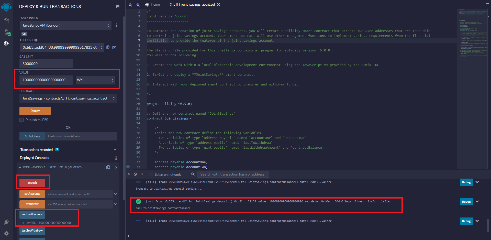
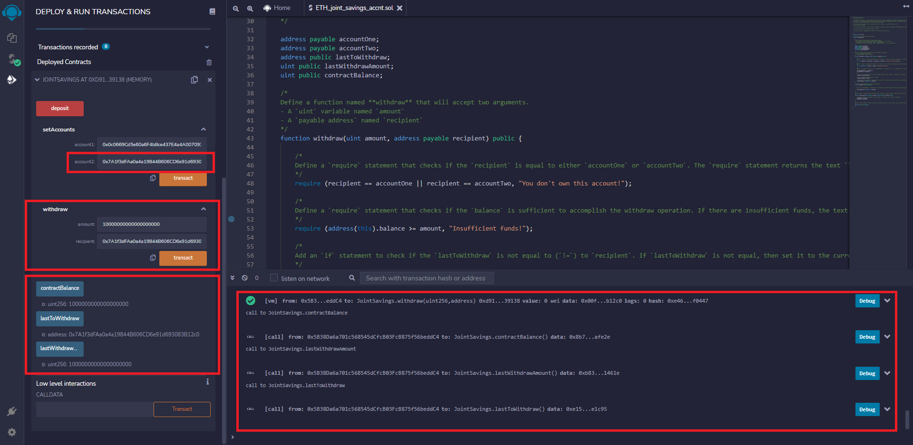

# Solidity Savings Account Smart Contract

This repository contains code to create of joint savings account using a Solidity smart contract. The smart contract accepts two user wallet addresses, which can control the joint savings account. The users are able to make deposits and withdrawls from the account. 

The smart contract was compiled and deployed using Remix IDE. Screenshot images of the deployed contract executing withdrawls and deposits are included in the folder "Execution_Results." As a sample, a screenshot of a deposit and withdraw are shown in the two images below, respectively.

